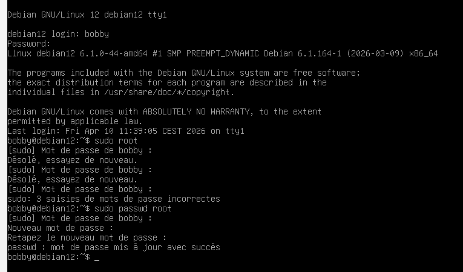
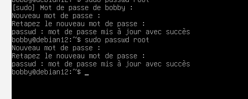

# US-005 : Sécurisation des mots de passe

## 🎯 Objectif

Modifier les mots de passe par défaut des comptes utilisateurs afin de sécuriser la machine.

---

## Actions réalisées

### Changement du mot de passe de bobby

Commande utilisée :

```bash
passwd bobby

verification:



```
