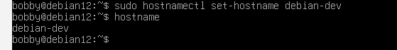
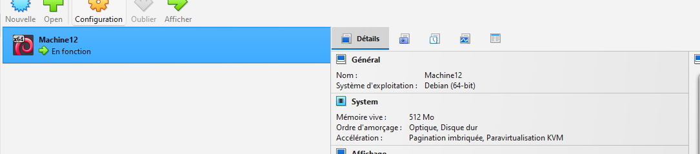

# US-006 : Renommage de la VM (hostname)

## 🎯 Objectif

Renommer la machine Debian afin de l’identifier facilement.

---

## ⚙️ Commandes utilisées

### Changement du hostname

```bash
sudo hostnamectl set-hostname linux-sprint
```



