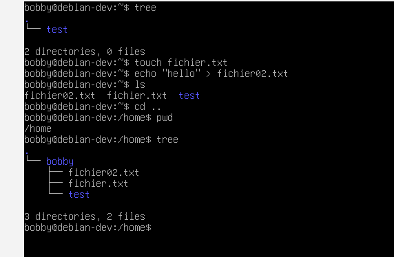
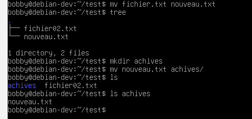
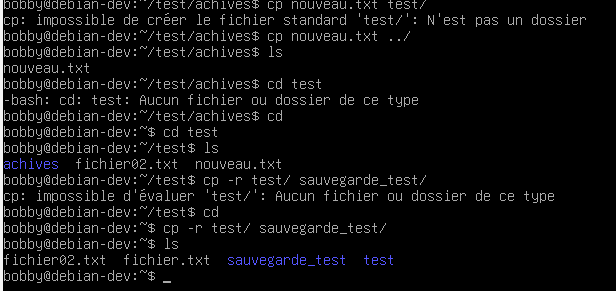
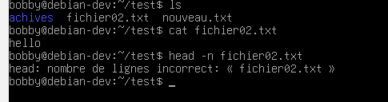

# US-008 : Gestion des fichiers et dossiers

## Objectif

Créer et organiser des fichiers et des répertoires sous Linux.

---

## Création de dossiers

```bash
mkdir test

```

### Création de fichiers

```bash
touch fichier.txt
echo "Bonjour" > fichier2.txt

```



Déplacement et renommage

```bash
mv fichier.txt nouveau.txt
mv nouveau.txt achives/

```



### Copie

```bash
cp nouveau.txt ../
cp -r test/ sauvegarde_test/
```



### Suppression

```bash
rm fichier2.txt
rmdir test
rm -r sauvegarde_test

```

### lecture

```bash
cat fichier02.txt
head -n 5 fichier02.txt

```


